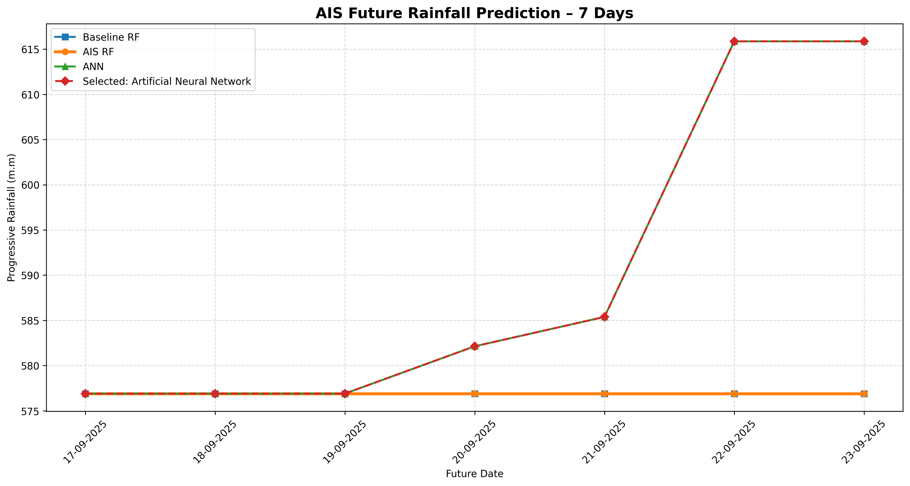

# 🌧️ Smart Cumulative Rainfall Prediction System using Particle Swarm Optimization (PSO)

An intelligent Machine Learning-based rainfall prediction system that analyzes historical daily rainfall records and predicts future cumulative (progressive) rainfall using **Particle Swarm Optimization (PSO)**-optimized Random Forest and Artificial Neural Networks.

The project performs complete preprocessing, feature engineering, model optimization, evaluation, visualization, future prediction, and model export.

---

# 📌 Table of Contents

- Project Overview
- Features
- Project Architecture
- Dataset
- Technologies Used
- Machine Learning Workflow
- PSO Optimization
- Feature Engineering
- Model Training
- Evaluation Metrics
- Generated Files
- Folder Structure
- Installation
- Usage
- Results
- Future Prediction
- Visualization
- Advantages
- Future Enhancements
- Author

---

# 🌍 Project Overview

Rainfall prediction is one of the most important applications of Machine Learning in agriculture, flood management, irrigation planning, and weather analytics.

This project predicts the **Progressive (Cumulative) Rainfall** using:

- Historical Daily Rainfall
- Date-based Features
- Rolling Statistics
- Previous Rainfall Values
- Previous Progressive Rainfall

Three models are trained:

- Baseline Random Forest
- **PSO Optimized Random Forest**
- Artificial Neural Network (ANN)

The best-performing model is automatically selected based on the lowest RMSE.

---

# ✨ Features

✔ Automatic data preprocessing

✔ Missing value handling

✔ Date feature extraction

✔ Lag feature generation

✔ Rolling statistics

✔ Particle Swarm Optimization

✔ Random Forest Regression

✔ Artificial Neural Network

✔ Automatic model comparison

✔ Future rainfall prediction

✔ JSON model configuration

✔ YAML configuration

✔ PKL model export

✔ H5 ANN export

✔ Accuracy graph

✔ Heatmap

✔ Comparison graph

✔ Prediction graph

✔ Result graph

✔ Optimization graph

✔ CSV result export

---

# 🏗 Project Architecture

```
Historical Rainfall Dataset
            │
            ▼
     Data Cleaning
            │
            ▼
 Feature Engineering
            │
            ▼
 Train/Test Split
            │
            ▼
     Baseline Random Forest
            │
            ▼
 Particle Swarm Optimization
            │
            ▼
 Optimized Random Forest
            │
            ▼
 Artificial Neural Network
            │
            ▼
 Model Comparison
            │
            ▼
 Best Model Selection
            │
            ▼
 Future Rainfall Prediction
            │
            ▼
 Save Models + Graphs + CSV
```

---

# 📂 Dataset

Dataset File

```
daily_rainfall_ndb.csv
```

Main Columns

| Column | Description |
|---------|-------------|
| District | District Name |
| Date | Observation Date |
| Daily Rainfall (m.m) | Daily Rainfall |
| Progressive (m.m) | Cumulative Rainfall |

---

# 🛠 Technologies Used

- Python
- Pandas
- NumPy
- Scikit-Learn
- TensorFlow / Keras
- Matplotlib
- Joblib
- JSON
- YAML

---

# 🤖 Machine Learning Models

## 1. Baseline Random Forest

Used as the benchmark model.

---

## 2. PSO Optimized Random Forest

Particle Swarm Optimization searches for the optimal Random Forest parameters including:

- Number of Trees
- Maximum Depth
- Minimum Samples Split
- Minimum Samples Leaf
- Maximum Features

The optimized parameters produce a better-performing Random Forest.

---

## 3. Artificial Neural Network

The ANN contains:

- Input Layer
- Dense Layer (64)
- Dropout
- Dense Layer (32)
- Dropout
- Dense Layer (16)
- Output Layer

---

# 🚀 Particle Swarm Optimization

Particle Swarm Optimization is a population-based optimization algorithm inspired by the movement of bird flocks and fish schools.

Each particle represents a candidate solution.

Each iteration updates particles using:

- Personal Best Position
- Global Best Position
- Velocity
- Inertia

PSO searches for hyperparameters that minimize prediction error.

Advantages:

- Fast convergence
- Global optimization
- Simple implementation
- Excellent for hyperparameter tuning

---

# ⚙ Feature Engineering

The following features are automatically generated.

## Date Features

- Year
- Month
- Day
- Week
- Quarter
- Day of Week
- Weekend
- Day of Year

---

## Cyclic Features

- Month Sin
- Month Cos
- Day Sin
- Day Cos

---

## Lag Features

- Previous Day Rainfall
- Rainfall Lag-2
- Rainfall Lag-3
- Previous Progressive Rainfall
- Progressive Lag-2

---

## Rolling Features

- Rolling Mean (3)
- Rolling Sum (3)
- Rolling Mean (7)
- Rolling Sum (7)

---

# 📈 Evaluation Metrics

The models are evaluated using:

- MAE
- MSE
- RMSE
- R² Score
- MAPE
- Accuracy

The model with the **lowest RMSE** is selected automatically.

---

# 📊 Generated Files

The project automatically generates:

```
pso_cumulative_rainfall_ann_model.h5

pso_cumulative_rainfall_model.pkl

pso_cumulative_rainfall_config.json

pso_cumulative_rainfall_config.yaml

pso_accuracy_graph.png

pso_heatmap.png

pso_comparison_graph.png

pso_result.csv

pso_result_graph.png

pso_prediction.csv

pso_prediction_graph.png

pso_training_history_graph.png

pso_optimization_history.csv

pso_optimization_graph.png
```

---

# 📁 Project Structure

```
Smart Cumulative Rainfall Prediction System
│
├── daily_rainfall_ndb.csv
│
├── pso_cumulative_rainfall_ann_model.h5
├── pso_cumulative_rainfall_model.pkl
├── pso_cumulative_rainfall_config.json
├── pso_cumulative_rainfall_config.yaml
│
├── pso_accuracy_graph.png
├── pso_heatmap.png
├── pso_comparison_graph.png
├── pso_result.csv
├── pso_result_graph.png
├── pso_prediction.csv
├── pso_prediction_graph.png
├── pso_training_history_graph.png
├── pso_optimization_graph.png
├── pso_optimization_history.csv
│
└── README.md
```

---

# 💻 Installation

Install dependencies

```bash
pip install pandas numpy matplotlib scikit-learn tensorflow pyyaml joblib
```

---

# ▶ Run

Execute:

```bash
python rainfall_prediction.py
```

All graphs, models, CSV files, JSON files, and YAML files will be automatically generated inside the project folder.

---

# 📊 Result

The system compares:

- Baseline Random Forest
- PSO Optimized Random Forest
- Artificial Neural Network

The model with the smallest prediction error is selected as the final prediction model.

---

# 🔮 Future Prediction

The system predicts rainfall for the next **7 days** using recursive forecasting.

The predicted values are exported into:

```
pso_prediction.csv
```

and visualized in

```
pso_prediction_graph.png
```

---

# 📉 Visualization

Below is the prediction visualization generated by the system.

> **Visualization**

<p align="center">

</p>

---

# 🌟 Advantages

- Automatic preprocessing
- Automatic feature generation
- Particle Swarm Optimization
- Multiple ML models
- ANN integration
- Hyperparameter optimization
- Automatic model selection
- Future forecasting
- Complete visualization
- Exportable trained models
- JSON/YAML configuration
- Easy deployment

---

# 🚀 Future Enhancements

- LSTM Rainfall Prediction
- GRU Networks
- Transformer Models
- Weather API Integration
- Live Dashboard
- Streamlit Deployment
- Flask REST API
- Mobile Application
- Multi-District Forecasting
- Seasonal Rainfall Prediction

---

# 👨‍💻 Author

**Sagnik Patra**

Assistant Professor (CSE)

Machine Learning | Artificial Intelligence | Data Science

---

# 📜 License

This project is developed for educational and research purposes.

Feel free to modify, improve, and extend it for your own applications.
